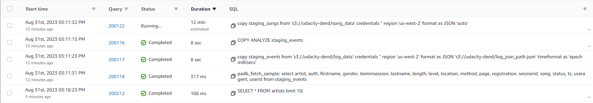

# Udacity-Data-Warehouse  


## Project Datasets
* Song data: 's3://udacity-dend/song_data'  
* Log data: 's3://udacity-dend/log_data'  

## Fact Table  
1. songplays - records in log data associated with song plays i.e. records with page NextSong
    * songplay_id, start_time, user_id, level, song_id, artist_id, session_id, location, user_agent  

## Dimension Tables  

2. users - users in the app  
   * user_id, first_name, last_name, gender, level  
3. songs - songs in music database    
   * song_id, title, artist_id, year, duration  
4. artists - artists in music database   
   * artist_id, name, location, latitude, longitude  
5. time - timestamps of records in songplays broken down into specific units  
   * start_time, hour, day, week, month, year, weekday  
  
## Project Template

1. `create_table.py`: This script is responsible for creating the necessary tables for the star schema in Amazon Redshift. It includes both fact and dimension tables, as well as staging tables.

2. `etl.py`: In this script, data is loaded from an S3 bucket into the staging tables on Amazon Redshift. Afterward, the data is processed and transformed into the final analytics tables in Redshift.

3. `sql_queries.py`: This file contains SQL statements that are used in both the create_table.py and etl.py scripts. It helps centralize and manage the SQL queries.

4. `test.ipynb`: This Jupyter Notebook is used for creating a Redshift cluster and setting up an IAM role with the necessary S3 read access. It also provides a way to verify the results after running the etl.py script.

5. `README.md`: The README file is used to document and explain the entire ETL pipeline. It typically includes discussions on the process, decisions made during development, and any other relevant information.

#### Design Table Schemas
1. Define schemas for both your fact and dimension tables.
2. Draft SQL CREATE statements for each of these tables in the `sql_queries.py` file.
3. Implement the logic in `create_tables.py` to establish a connection to the database and create these tables.
4. Incorporate SQL DROP statements at the beginning of `create_tables.py` to handle table existence, allowing you to reset your database and test your ETL pipeline as needed.
5. Launch a Redshift cluster and establish an IAM role with read access to S3.
6. Add the Redshift database and IAM role information to the `dwh.cfg` configuration file.
7. Verify functionality by executing `create_tables.py` and examining the table schemas within your Redshift database using the AWS Redshift Query Editor.

#### Develop ETL Pipeline
1. Implement the logic in `etl.py` to facilitate data transfer from S3 to staging tables within Redshift.
2. Extend the functionality in `etl.py` to manage data flow from staging tables to analytical tables on Redshift.
3. Validate the ETL process by running `etl.py` after executing `create_tables.py`, and subsequently, execute analytic queries on your Redshift database to confirm results align with expectations.
4. When your tasks are completed, don't forget to delete your Redshift cluster for cost efficiency.

## How to run scripts

Set environment variables `KEY` and `SECRET`.

Choose `DB/DB_PASSWORD` in `dhw.cfg`.

Create IAM role, Redshift cluster, connect to S3 bucket and configure TCP connectivity  

Drop and recreate tables

```bash
$ python create_tables.py
```

Run ETL pipeline

```bash
$ python etl.py
```  

Delete IAM role and Redshift cluster

## Result:    
